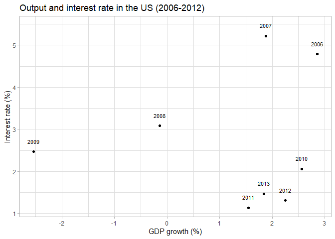
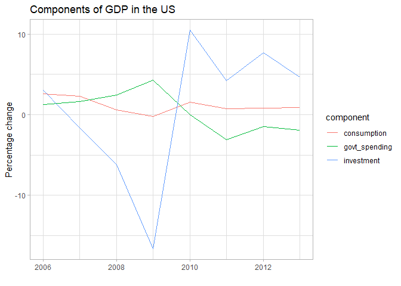

SSCECON207 workshop I:<br>Introduction to R and ggplot
================
Spring 2022

-   [1 Learning outcomes](#learning-outcomes)
-   [2 First steps](#first-steps)
    -   [2.1 Your working directory](#your-working-directory)
    -   [2.2 Installing `tidyverse`](#installing-tidyverse)
-   [3 Importing and cleaning the
    data](#importing-and-cleaning-the-data)
    -   [3.1 Importing a CSV file](#importing-a-csv-file)
    -   [3.2 Filtering the data](#filtering-the-data)
    -   [3.3 Other data manipulation](#other-data-manipulation)
-   [4 First `ggplot` figures](#first-ggplot-figures)
-   [5 Useful links](#useful-links)

# 1 Learning outcomes

In this tutorial you will learn the steps needed to create basic figures
in R. You can use these skills to create a poster where you analyze
empirical evidence on a policy intervention in the context of the IS-LM
model.

You will learn how to import data into R, how to filter and select the
data that you need, and how to make basic figures using the `ggplot2`
package.

# 2 First steps

This tutorial assumes that you have already installed R and RStudio, and
have read [A (very) short introduction to
R](https://github.com/ClaudiaBrauer/A-very-short-introduction-to-R/blob/master/documents/A%20(very)%20short%20introduction%20to%20R.pdf)
and [How to make any plot in
ggplot2?](http://r-statistics.co/ggplot2-Tutorial-With-R.html#6.1%20Make%20a%20time%20series%20plot%20(using%20ggfortify)).

## 2.1 Your working directory

Once you open RStudio, it is useful to set your working directory. This
is the folder where you will save your datafiles, R scripts and figures.
To set a folder as your working directors, copy the following code and
change the file path to the folder that you would like to use. If you
are using Windows, you need to manually change the backslashes (\\) to
forward slashes (/) before you run the code.

You can set the working directory with the following function:

``` r
setwd("C:/Users/Tina/Documents/SSCECON207")
```

## 2.2 Installing `tidyverse`

Next, you need to install and load the `tidyverse` package. This is a
collection of packages that allow clean workflows in R. The `ggplot2`
package that you will use to create figures is one of the included
packages.

You need to install the package only once, but you need to load it every
time you open and use R. It is good practice to load the package on the
top of each script.

``` r
install.packages("tidyverse") # install the package
```

``` r
library(tidyverse) # load the package
```

# 3 Importing and cleaning the data

## 3.1 Importing a CSV file

Next, you need to import your data, which is in the format of a CSV
(comma-separated values) file. Download the data file from Moodle (add
filename, location) and save it in the same folder that you set as your
working directory.

You can import a file using the `read_csv()` function and by assigning
the file to an object.

``` r
data <- read_csv("ISLM_data.csv")
```

## 3.2 Filtering the data

For your project you’ll only need to use part of the data. To see what
the data frame looks like, you can view it by clicking on the name of
the object in the Environment tab in the top right corner of RStudio.

The file “available\_data.csv” provides a list of the countries and time
periods available in the dataset. You can use this file to select a
policy intervention to study. You can view the file
[here](https://github.com/ucrdatacenter/projects/blob/main/SSCECON207/available_data.csv).

Once you decide which country and time period you would like to use in
your project, you need to filter the data to remove the observations
that you don’t need. You can do that with the `filter()` function. For
example if you are looking for US data between 2006-2013, you can do
that as follows:

``` r
data_US <- data %>%
  filter(year >= 2006, year <= 2013, code == "USA")
```

The pipe operator (`%>%`) means that the next function uses the previous
result as an input: in this case, it takes the object `data` as the
first argument of the `filter()` function.

The double equal sign in `code == "USA"` means that instead of assigning
the string `"USA"` to a variable named country (which is what the code
`code == "USA"` would do), you are testing whether the contents of the
object `code` and the string `"USA"` are equal to each other. Similarly,
the less-than-or-equal and more-than-or-equal signs test the
relationship between the contents of the variable `year` and the
specified year. If the result of the test is true, the function keeps
the observation, and if the result is false, the observation is removed.
You can filter for country using both the variable `country`, which has
full country names, or using the variable `code` with country code. The
results of the two operations will be equivalent. Make sure to remember
that R is case-sensitive, so e.g. a filter set as `country == "usa"`
will not work.

## 3.3 Other data manipulation

In some cases it is easier to work with a data frame that only includes
the variables that you need. You can select these variables using the
`select()` function. You can either list the variables that you want to
keep as the arguments of the function, or you can list the variables you
want to remove, using a `-` sign in front of the variable name.

For example, you can filter your data to only include the year and the
components of GDP:

``` r
data_US %>% 
  select(year, consumption, investment, govt_spending)
```

    ## # A tibble: 8 x 4
    ##    year consumption investment govt_spending
    ##   <dbl>       <dbl>      <dbl>         <dbl>
    ## 1  2006       2.59        3.06        1.22  
    ## 2  2007       2.28       -1.62        1.60  
    ## 3  2008       0.576      -6.21        2.45  
    ## 4  2009      -0.251     -16.6         4.26  
    ## 5  2010       1.53       10.5         0.0111
    ## 6  2011       0.761       4.22       -3.07  
    ## 7  2012       0.831       7.66       -1.46  
    ## 8  2013       0.858       4.67       -1.89

If you want to plot these variables on one figure, it helps to turn the
data into long format.

Now each row of the data corresponds to one year, and three columns show
the values of three variables. This is called wide format. In long
format you would have three rows corresponding to one year, a single
column of variable values, and a column specifying which component of
GDP that value is.

You can convert between these two forms using the `pivot_longer()` and
`pivot_wider()` functions. Below is an example of using
`pivot_longer()`. If you need more help on the function arguments, the
help-files of the function provide a good explanation. You can access
these files by running `?pivot_longer()` and `?pivot_wider()`.

``` r
data_US %>% 
  select(year, consumption, investment, govt_spending) %>% 
  pivot_longer(cols = -year, names_to = "component", values_to = "value") # cols = -year -> use all columns except year
```

    ## # A tibble: 24 x 3
    ##     year component      value
    ##    <dbl> <chr>          <dbl>
    ##  1  2006 consumption    2.59 
    ##  2  2006 investment     3.06 
    ##  3  2006 govt_spending  1.22 
    ##  4  2007 consumption    2.28 
    ##  5  2007 investment    -1.62 
    ##  6  2007 govt_spending  1.60 
    ##  7  2008 consumption    0.576
    ##  8  2008 investment    -6.21 
    ##  9  2008 govt_spending  2.45 
    ## 10  2009 consumption   -0.251
    ## # ... with 14 more rows

# 4 First `ggplot` figures

Figures made with `ggplot` are built from several layers. You always use
the same basic code structure to create a wide range of figures:

1.  The `ggplot()` function creates a blank canvas for you to work on.
2.  Geoms add the visual elements, such as points, lines, bars or other
    shapes.
3.  Other specifications can include changing axis settings, setting the
    theme, adding labels, etc.
4.  You connect all these different specifications to each other using
    `+` signs.

The variables that you want to display on the graph must always be
wrapped in an `aes()` function, which stands for aesthetics. This tells
R to determine the value of the aesthetic (x and y axes, colors, groups,
line types, etc.) based on the value of the variable. `aes()` can be
specified both in the main `ggplot()` function (in which case it will
apply to all geoms) or within a `geom_...()` function (then it only
applies to that geom).

The following code creates a time-series plot of the interest rate in
the US over time. Comments at the end of each line explain what is
happening.

``` r
data_US %>% # feed the previously created data frame into the ggplot function call
  ggplot() + # create the ggplot "blank canvas"
  geom_line(aes(x = year, y = rate)) + # set the variables to be displayed on the x and y axes
  labs(title = "Interest rate in the US", # add a title to the plot
       x = "Year", # set the x axis label
       y = "Interest rate (%)") + # set the y axis label
  theme_light() # change the color scheme and layout of the plot to a different theme
```

<!-- -->

If you are happy with how a figure looks, you can save it using the
`ggsave()` function and specifying the file name you want to use:

``` r
ggsave("interest_rate.jpg") # save the plot
```

If instead of a time series plot, you want to make a scatterplot, you
would use `geom_point()` instead of `geom_line()`. Additionally, you can
use `geom_text()` to display labels next to the points. This requires
you to set an additional aesthetic: the label you want displayed. Other
settings are also possible within each geom, such as size, color,
transparency, etc.

``` r
data_US %>% 
  ggplot(aes(x = GDP, y = rate)) + # if the aesthetics are set in the main ggplot() function, they apply to all geoms
  geom_point() + # make a scatterplot
  geom_text(aes(label = year), nudge_y = 0.25, size = 3) + # add the years as labels next to each point
  labs(title = "Output and interest rate in the US (2006-2012)",
       x = "GDP growth (%)",
       y = "Interest rate (%)") +
  theme_light()
```

<!-- -->

``` r
ggsave("scatterplot.jpg") 
```

You can also connect `ggplot` figures to data cleaning/manipulation
processes using the `%>%` operator introduced previously. The code below
connects the data manipulation shown previously to a time-series plot of
the components of GDP:

``` r
data_US %>% 
  select(year, consumption, investment, govt_spending) %>% 
  pivot_longer(cols = -year, names_to = "component", values_to = "value") %>%
  ggplot() +
  geom_line(aes(x = year, y = value, color = component)) +
  labs(title = "Components of GDP in the US",
       x = "",
       y = "Percentage change") +
  theme_light()
```

<!-- -->

``` r
ggsave("GDP.jpg")
```

# 5 Useful links

You can find additional materials, including useful data sources, and
online materials for using R and `ggplot` on the [Data Center
website](https://ucrdatacenter.github.io/SSCECON207#Suppporting_materials).
